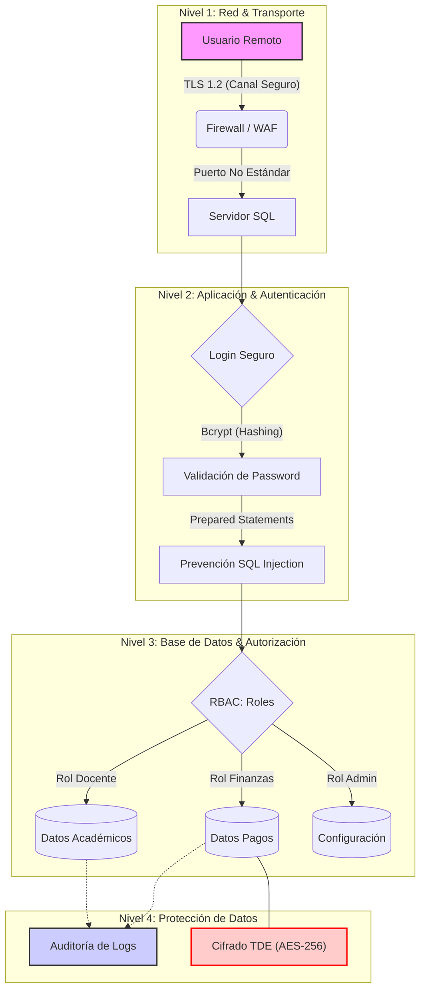

# School-DB-Security
Diseño de arquitectura segura para gestión de datos académicos, aplicando principios de 'Privacidad por Diseño', hardening de servidores SQL y mitigación de vulnerabilidades como Inyección SQL

